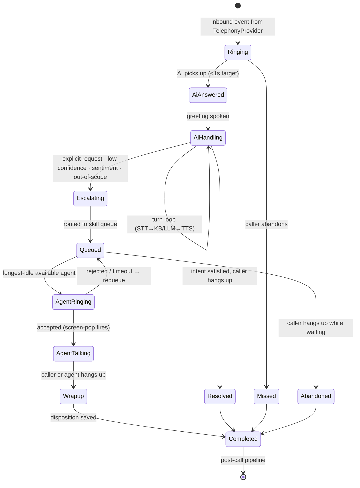
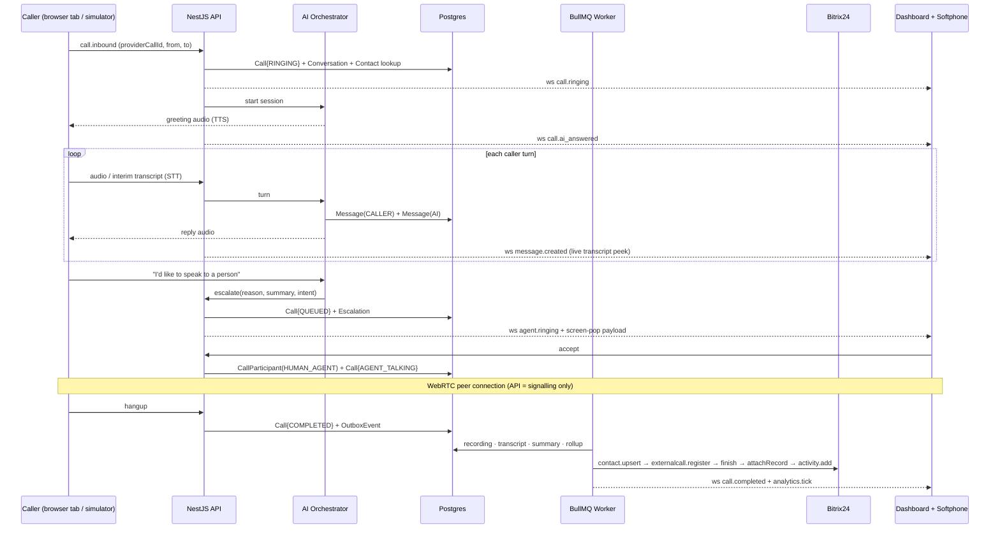

# SuperDemo — Architecture (LLD)

**Client:** FIT Institute, Dubai (JLT) — KHDA-approved training provider, ~3,700 students, 20+ diplomas across Management / Education / Finance / Language.
**Vendor:** hirestella.ai
**Product:** AI-first contact centre — inbound AI voice with warm handoff to human agents, unified in one dashboard, synchronised with their existing Bitrix24 CRM.

**Decisions taken (2026-08-03):**

| Decision | Choice | Consequence |
|---|---|---|
| Delivery | Demo shell now, on production architecture | Nothing gets thrown away; stubs sit behind real interfaces |
| Voice stack | **Mocked with free tooling**, real carrier deferred | £0 to run; swap one driver later |
| Tenancy | **Single-tenant** (FIT only) | No `tenant_id`, no RLS. Deploy-per-customer model |
| v1 channels | **Inbound AI voice → human handoff**, plus **mocked WhatsApp** | Both fully working against mock providers; web chat + outbound scaffolded |
| UAE numbers | **Mock DID provisioning** — realistic +971 virtual-number inventory, purchase/assign/release flow | Demos the SIM-replacement story end-to-end; swap to a licensed carrier later |
| Local Postgres | **`embedded-postgres` (real PG 17.10 binaries, repo-local)** | This machine has no Homebrew or any system package manager — verified. Zero system install, standard TCP connection string, Prisma works unmodified |

---

## 1. The core architectural idea

Everything the client actually sees — dashboard, live board, transcripts, recordings, analytics, Bitrix timeline entries — runs on **real production code paths**. Only the *carrier* is fake.

```
┌─────────────────────────────────────────────────────────────┐
│  SWAPPABLE (driver per env var)                             │
│  TelephonyProvider · SttProvider · TtsProvider · LlmProvider │
└───────────────────────────┬─────────────────────────────────┘
                            │ same events, same DTOs
┌───────────────────────────▼─────────────────────────────────┐
│  REAL FROM DAY ONE                                          │
│  Call state machine · Queue & routing · Escalation           │
│  Postgres schema · Outbox · BullMQ workers · WebSocket fan-out│
│  Recording store · Transcript store · Analytics rollups      │
│  Bitrix24 sync (genuinely live — free Bitrix plan)           │
│  Next.js dashboard + agent softphone                         │
└─────────────────────────────────────────────────────────────┘
```

`TELEPHONY_DRIVER` has three values in v1, all free:

| Driver | What it does | Used for |
|---|---|---|
| `simulated` | Deterministic scenario runner. Replays a scripted FIT call (ring → AI turns → escalation → agent → hangup → recording → transcript → CRM push) on a realistic timeline, emitting the *real* domain events. | Seeding a live-looking dashboard; E2E tests; unattended demo loop |
| `browser` | The audience **actually talks to the AI**. Chrome `SpeechRecognition` → our AI engine → `SpeechSynthesis` speaks back. `MediaRecorder` produces a real recording. Escalation opens a raw `RTCPeerConnection` between caller tab and agent tab, with our API as signalling server. | The live wow-moment in the demo |
| `livekit` | Stub file + interface only. Real SIP in/out when a carrier is contracted. | Phase 2 |

The `browser` driver is the whole trick: a genuinely voice-interactive AI phone agent with recording, transcript, warm transfer and CRM sync, for **zero provider cost**, using only browser APIs that ship in Chrome and Edge.

---

## 2. Repository layout

pnpm workspaces + Turborepo. Node 24, TypeScript 5.7, ESM.

```
FIT-AI/                         the checkout directory, unchanged; the packages
│                               are @superdemo/* and the workspace is `superdemo`
├── apps/
│   ├── web/                    Next.js 15 · App Router · React 19
│   │   ├── app/
│   │   │   ├── (auth)/login/
│   │   │   └── (app)/
│   │   │       ├── page.tsx                  Live Ops board
│   │   │       ├── conversations/[id]/
│   │   │       ├── analytics/
│   │   │       ├── agents/
│   │   │       ├── ai-agents/[id]/           voicebot config + browser test
│   │   │       ├── knowledge/
│   │   │       ├── simulator/                drive mock calls + WhatsApp msgs
│   │   │       └── settings/{bitrix,numbers,queues,users}/
│   │   ├── components/softphone/             docked, persists across routes
│   │   └── lib/{api,socket,audio}/
│   │
│   ├── api/                    NestJS 11 · Fastify adapter
│   │   └── src/
│   │       ├── modules/
│   │       │   ├── auth/          JWT access+refresh, argon2, httpOnly cookies
│   │       │   ├── users/         agents, supervisors, admins
│   │       │   ├── presence/      agent state machine + append-only events
│   │       │   ├── calls/         call lifecycle state machine  ◄── core
│   │       │   ├── conversations/ channel-agnostic thread + messages
│   │       │   ├── routing/       queues, skills, longest-idle selection
│   │       │   ├── escalation/    AI → queue → agent warm transfer
│   │       │   ├── recordings/    storage + signed URLs + retention
│   │       │   ├── transcripts/   segments, speaker labels, search
│   │       │   ├── ai/            orchestrator: STT→LLM→TTS turn loop
│   │       │   ├── knowledge/     FIT course KB, chunking, pgvector search
│   │       │   ├── analytics/     live counters + daily rollups
│   │       │   ├── realtime/      socket.io gateway (Redis adapter)
│   │       │   ├── crm/           Bitrix24 sync (both directions)
│   │       │   ├── whatsapp/      channel handler (mock provider in v1)
│   │       │   ├── numbers/       DID inventory + provisioning (mock +971 stock)
│   │       │   ├── simulator/     drives mock inbound calls & WhatsApp traffic
│   │       │   └── webhooks/      bitrix + whatsapp inbound, signature-verified
│   │       ├── integrations/
│   │       │   ├── telephony/{simulated,browser,livekit}/
│   │       │   ├── messaging/{mock-whatsapp,meta-cloud}/
│   │       │   ├── stt/{web-speech,whisper-local,deepgram}/
│   │       │   ├── tts/{web-speech,piper-local,elevenlabs}/
│   │       │   ├── llm/{scripted,ollama,claude}/
│   │       │   ├── storage/{local,r2}/
│   │       │   └── crm/{bitrix,mock}/
│   │       ├── main.ts           HTTP + WebSocket entrypoint
│   │       ├── worker.ts         BullMQ-only entrypoint (same codebase)
│   │       └── shared/  outbox, idempotency, pino logger, guards, filters
│
├── packages/
│   ├── contracts/              zod schemas · DTOs · socket event types · env schema
│   ├── db/                     Prisma schema · migrations · seed (real FIT data)
│   ├── ui/                     shadcn/ui primitives + shared charts
│   └── config/                 eslint · tsconfig · tailwind presets
│
├── ARCHITECTURE.md   SKILLS.md   NOT-IMPLEMENTED.md
└── turbo.json  pnpm-workspace.yaml
```

`packages/contracts` is the single source of truth. Zod schemas there generate: NestJS validation pipes (`nestjs-zod`), OpenAPI, TS types for the web app, and socket payload types. One definition, no drift.

---

## 3. Call lifecycle — the heart of the system



**Post-call pipeline** (BullMQ, each step idempotent and independently retried):

```
call.completed
  ├─► persist-recording        MediaRecorder blob / synthesised WAV → object store
  ├─► transcribe               segments + speaker labels (already have them in browser mode)
  ├─► summarise                AI summary + extracted intent + course of interest
  ├─► crm-sync                 Bitrix: contact upsert → externalcall.register/finish/attachRecord → activity.add
  ├─► metrics-rollup           increment call_metrics_daily
  └─► notify                   socket emit → dashboard tiles update live
```

**Escalation carries context.** The transfer payload is not just a call leg — it is `{ contact, aiSummary, detectedIntent, courseOfInterest, transcriptSoFar, sentiment, bitrixContactUrl }`. The agent's screen-pop renders that *before* they say hello. This is the single most demo-able feature and it is why the AI layer is worth paying for.

---

## 4. Data model

PostgreSQL 17 + Prisma 6. pgvector for KB search. Abridged — types and non-obvious columns only.

```prisma
// ── People & presence ────────────────────────────────────────────
model User {
  id        String   @id @default(uuid())
  email     String   @unique
  name      String
  role      Role                          // AGENT | SUPERVISOR | ADMIN
  location  Location                      // DUBAI | INDIA | EGYPT
  timezone  String                        // Asia/Dubai | Asia/Kolkata | Africa/Cairo
  skills    String[]                      // ["finance","education","language","management"]
  presence  AgentState?
}

/// Current state — one row per agent, cheap to read for the live board.
model AgentState {
  userId    String   @id
  status    Status                        // AVAILABLE BUSY ON_CALL WRAPUP BREAK OFFLINE
  since     DateTime
  currentCallId String?
}

/// Append-only. Every state transition. Source of truth for occupancy,
/// adherence and shift reports — never derive productivity from AgentState.
model AgentStateEvent {
  id        BigInt   @id @default(autoincrement())
  userId    String
  from      Status?
  to        Status
  at        DateTime
  reason    String?
  @@index([userId, at])
}

// ── Contacts (local mirror of Bitrix) ────────────────────────────
model Contact {
  id             String  @id @default(uuid())
  phoneE164      String? @unique
  name           String?
  email          String?
  bitrixEntity   String?                  // "lead" | "contact"
  bitrixId       String?
  bitrixSyncedAt DateTime?
  courseInterest String?
}

// ── Conversation: channel-agnostic parent ────────────────────────
// Voice today; WhatsApp and web chat drop in with zero schema change.
model Conversation {
  id         String   @id @default(uuid())
  channel    Channel                      // VOICE | WHATSAPP | WEBCHAT
  direction  Direction                    // INBOUND | OUTBOUND
  contactId  String?
  queueId    String?
  status     ConvStatus
  startedAt  DateTime
  endedAt    DateTime?
  disposition String?                     // ENROLLED_INTEREST | INFO_ONLY | SPAM | CALLBACK …
  call       Call?
  messages   Message[]
}

model Call {
  id              String @id @default(uuid())
  conversationId  String @unique
  providerCallId  String @unique          // driver-supplied; guarantees idempotency
  fromNumber      String
  toNumber        String
  state           CallState               // mirrors the state machine above
  ringingAt       DateTime
  aiAnsweredAt    DateTime?
  escalatedAt     DateTime?
  agentAnsweredAt DateTime?
  endedAt         DateTime?
  hangupCause     String?
  queueWaitMs     Int?                    // escalatedAt → agentAnsweredAt
  aiTalkMs        Int?
  agentTalkMs     Int?
  wrapMs          Int?
  participants    CallParticipant[]
}

/// Models the handoff explicitly: one call, multiple participants over time.
/// Avoids the classic mistake of a single nullable agentId on Call.
model CallParticipant {
  id       String @id @default(uuid())
  callId   String
  kind     ParticipantKind                // CALLER | AI_AGENT | HUMAN_AGENT
  userId   String?
  joinedAt DateTime
  leftAt   DateTime?
}

/// Unified turn record — an AI voice turn and a WhatsApp message are the same shape.
model Message {
  id             String @id @default(uuid())
  conversationId String
  role           MsgRole                  // CALLER | AI | HUMAN_AGENT | SYSTEM
  text           String
  audioOffsetMs  Int?                     // aligns transcript to waveform playback
  confidence     Float?
  createdAt      DateTime @default(now())
  @@index([conversationId, createdAt])
}

// ── Media & AI ───────────────────────────────────────────────────
model Recording {
  id         String @id @default(uuid())
  callId     String @unique
  storageKey String                       // local disk in dev, R2/S3 in prod
  durationMs Int
  mimeType   String
  sizeBytes  Int
  expiresAt  DateTime?                    // retention policy
}

model TranscriptSegment {
  id        BigInt @id @default(autoincrement())
  callId    String
  speaker   ParticipantKind
  startMs   Int
  endMs     Int
  text      String
  @@index([callId, startMs])
}

model AiSession {
  id              String @id @default(uuid())
  callId          String @unique
  aiAgentId       String
  driverStt       String                  // audit which drivers ran
  driverLlm       String
  driverTts       String
  turns           Int
  escalated       Boolean
  escalationReason String?
  costUsd         Decimal? @db.Decimal(10,6)
}

model AiAgent {
  id            String @id @default(uuid())
  name          String
  greeting      String
  systemPrompt  String
  voice         String
  escalationRules Json                    // keywords, confidence floor, max turns
  isActive      Boolean
}

model KnowledgeDoc {
  id     String @id @default(uuid())
  title  String
  source String
  chunks KnowledgeChunk[]
}

model KnowledgeChunk {
  id        String @id @default(uuid())
  docId     String
  content   String
  embedding Unsupported("vector(1024)")?  // pgvector; null in scripted mode
}

// ── Routing ──────────────────────────────────────────────────────
// Queues map to FIT's four course categories — real skills-based routing,
// not a demo prop.
model Queue {
  id            String @id @default(uuid())
  name          String                    // Finance · Education · Language · Management
  requiredSkill String
  slaSeconds    Int    @default(20)
  strategy      Strategy                  // LONGEST_IDLE | ROUND_ROBIN | SKILL_WEIGHTED
}

// ── Integration plumbing ─────────────────────────────────────────
/// Transactional outbox. Domain writes and event publication commit together;
/// the worker drains it. No lost CRM pushes, no dual-write bugs.
model OutboxEvent {
  id          BigInt @id @default(autoincrement())
  aggregate   String
  aggregateId String
  type        String
  payload     Json
  publishedAt DateTime?
  attempts    Int @default(0)
  lastError   String?
  @@index([publishedAt, id])
}

model CrmSyncLog {
  id           BigInt @id @default(autoincrement())
  direction    SyncDirection             // OUTBOUND_TO_BITRIX | INBOUND_FROM_BITRIX
  method       String                    // crm.contact.add, telephony.externalcall.finish …
  entityType   String
  localId      String?
  bitrixId     String?
  status       SyncStatus
  request      Json
  response     Json?
  attempts     Int @default(0)
  @@index([status, id])
}

/// Pre-aggregated so /analytics never scans the calls table.
model CallMetricsDaily {
  day              DateTime
  queueId          String?
  agentId          String?
  calls            Int
  aiContained      Int
  escalated        Int
  abandoned        Int
  answeredWithinSla Int
  talkMsTotal      BigInt
  @@id([day, queueId, agentId])
}

model AuditLog {
  id       BigInt @id @default(autoincrement())
  actorId  String?
  action   String
  target   String
  metadata Json
  at       DateTime @default(now())
}
```

**Design notes worth defending in review:**
- `CallParticipant` instead of `Call.agentId` — the AI→human handoff *is* the product; the schema has to represent both legs, and it makes multi-party conference (Phase 2) free.
- `Conversation` above `Call` — WhatsApp and web chat land as new `channel` values with no migration. This is what "unified dashboard" means structurally.
- `AgentStateEvent` append-only — occupancy and adherence reports are unreliable if derived from mutable current-state rows.
- `OutboxEvent` — Bitrix is an external system that will be down sometimes. The outbox makes "call recorded in our DB but missing in CRM" impossible rather than merely unlikely.
- `providerCallId` unique — carriers and simulators both redeliver events; idempotency is enforced at the database, not in application `if` statements.

---

## 5. Request & realtime flow



**Realtime transport:** socket.io with the Redis adapter. Rooms: `user:{id}` (screen-pop, softphone), `role:supervisor` (live board), `call:{id}` (live transcript). Every payload typed in `packages/contracts`. Chose socket.io over raw WS for reconnection/backoff and room semantics that we'd otherwise reimplement badly.

---

## 6. Bitrix24 integration — real, and free

Bitrix24's free cloud plan plus **inbound webhooks** covers everything v1 needs. No app publishing, no marketplace review.

**Outbound (us → Bitrix):**
| Purpose | Method |
|---|---|
| Identify / create caller | `crm.contact.list` → `crm.contact.add` / `crm.lead.add` |
| Put the call in their timeline | `telephony.externalcall.register` → `.show` → `.finish` |
| Attach our recording | `telephony.externalcall.attachRecord` |
| Log AI transcript + summary | `crm.activity.add` |

**Inbound (Bitrix → us):** outbound webhook on `ONCRMLEADADD` / `ONCRMCONTACTUPDATE` → `POST /webhooks/bitrix` (signature-verified, queued, idempotent by event id).

That `telephony.externalcall.*` sequence is the demo's closing move: *"your team keeps working in Bitrix — every AI call, recording and transcript now appears in the lead's timeline automatically."*

**Known limitation, documented not hidden:** `imconnector.register` (pushing WhatsApp/chat into Bitrix Open Channels) only works in *application* context, not via inbound webhook. Phase 2 requires a Bitrix local app with OAuth. See NOT-IMPLEMENTED.md.

---

## 7. Frontend architecture

- **Next.js 15 App Router.** Server Components for shells and static chrome; Client Components for everything realtime. No SSR on the live board — it would fight the WebSocket.
- **State:** TanStack Query v5 for server state (WebSocket events invalidate or patch the cache — no polling anywhere). Zustand for the softphone's local state machine only. No global Redux.
- **The softphone is docked, not a page.** It lives in the `(app)` layout so an agent can browse conversations while on a call — a real contact-centre requirement that page-based softphones fail.
- **Timezones are first-class.** Agents span Asia/Dubai, Asia/Kolkata, Africa/Cairo. All timestamps stored UTC, rendered in the viewer's tz, and analytics bucketed in the *institute's* tz (Asia/Dubai) so "calls by hour" means something.
- **Charts:** Recharts, one shared theme, light+dark, colour-blind-safe categorical ramp.
- **Recording playback:** wavesurfer.js waveform with the transcript scroll-locked to playhead via `audioOffsetMs`, escalation marked on the timeline.
- **Accessibility:** shadcn/Radix primitives, keyboard-driven softphone (answer/hangup/hold on hotkeys — agents don't use mice), visible focus, live-region announcements for incoming calls.

**Screens**

| Route | Purpose |
|---|---|
| `/` | Live Ops — active calls, queue depth, longest wait, AI vs human split, agent grid |
| `/conversations` | Unified inbox — filter by channel, disposition, agent, queue, date, AI-contained |
| `/conversations/[id]` | Waveform + synced transcript, AI reasoning trail, escalation marker, Bitrix card |
| `/analytics` | Volume trends, containment funnel, SLA, hour×day heatmap, per-location comparison |
| `/agents` | Roster, live states, scorecards, break/shift adherence |
| `/ai-agents/[id]` | Voicebot config + **Test in browser** (the live Web Speech demo) |
| `/knowledge` | FIT course knowledge base |
| `/settings/…` | Bitrix connection + field mapping + sync log, numbers, queues, users |

---

## 8. Metrics the dashboard must produce

Directly answering *"monitor call history and analytics"* and *"track agent performance and productivity"*:

**Contact-centre standard:** ASA, AHT, ACW, abandonment rate, SLA % answered <20s, occupancy %, transfer rate, calls per agent-hour.

**AI-specific (this is where the value story lives):**
- **Containment rate** — % resolved by AI with no human. The number that justifies the contract.
- Escalation rate broken down by reason (explicit request / low confidence / out-of-scope / sentiment).
- Turns-to-resolution, AI response latency p50/p95.
- Cost per contained call vs cost per agent-handled call.

**FIT-specific:** enquiries by course category, top requested diplomas, enquiry→enrolment-interest conversion, peak-hour staffing gaps per location.

---

## 9. Non-functional

**Security.** argon2id passwords · JWT access (15m) + rotating refresh with reuse detection, httpOnly SameSite=Strict cookies · casl RBAC (agent sees own calls; supervisor sees team; admin sees settings) · helmet · CORS allowlist · `@nestjs/throttler` · zod-validated env, fail-fast on boot · recordings behind short-lived signed URLs, every access audited · PII redacted in logs · recording-consent announcement on answer (UAE + India + Egypt all require it) · webhook signature verification.

**Reliability.** Idempotency keys on all provider events · transactional outbox · BullMQ exponential backoff + DLQ · `@nestjs/terminus` health/readiness · graceful shutdown draining in-flight calls · pino structured logs with correlation id spanning HTTP → queue → WebSocket.

**Performance.** Fastify adapter · analytics served from `CallMetricsDaily`, never live aggregation · cursor pagination on conversations · Redis cache for KB lookups · AI turn latency budget 800ms end-to-end (browser Web Speech comfortably beats this locally).

**Testing.** Vitest units · Supertest API e2e against a dedicated Postgres schema · Playwright E2E driving the `simulated` driver through a full ring→AI→escalate→answer→hangup→CRM cycle · MSW for frontend · seed script loads real FIT courses so every environment looks like the demo.

---

## 10. Local run (no Docker, no Homebrew, no system installs)

This machine has **no Homebrew and no system package manager** (verified: `brew`, `port`, `nix`, `pkgin`, `mise`, `asdf` all absent). Redis 7.4.2 is present at `~/.local/bin`. So Postgres is vendored into the repo:

- **`embedded-postgres`** downloads and manages genuine PostgreSQL **17.10** binaries (`initdb`, `pg_ctl`, `postgres`) under `node_modules`. Cluster lives in `.data/pg/`, listens on `localhost:55432`. It is a real Postgres server over TCP — Prisma, migrations and the separate worker process all connect normally.
- **pgvector is not available** this way, so `KnowledgeChunk.embedding` is `Float[]` and cosine similarity is computed in-process. At a few hundred FIT course chunks this is sub-millisecond; pgvector becomes a drop-in swap in production (see NOT-IMPLEMENTED.md).
- `scripts/services.mjs` starts/stops both Postgres and Redis, guarding `initdb` against an already-initialised cluster.

```bash
pnpm install                 # postinstall approval is pre-declared in pnpm-workspace.yaml
pnpm services:up             # boots embedded Postgres :55432 + Redis :6379
pnpm db:migrate && pnpm db:seed   # real FIT courses, 12 agents, 4 queues, ~200 historical calls
pnpm dev                     # web :3000 · api :3001 · worker
```

`apps/api` has two entrypoints against one codebase: `main.ts` (HTTP + WebSocket) and `worker.ts` (BullMQ processors only). `pnpm dev` runs both; production deploys them as separate processes.

`.env` defaults to `TELEPHONY_DRIVER=simulated`, `LLM_DRIVER=scripted`, `CRM_DRIVER=mock`. Flip `CRM_DRIVER=bitrix` with a webhook URL for the real Bitrix demo; flip `TELEPHONY_DRIVER=browser` for the talk-to-the-AI demo.

**Deploy (all free tiers):** Vercel (web) · Fly.io or Railway (api + worker) · Neon (Postgres + pgvector) · Upstash (Redis) · Cloudflare R2 (recordings).
**Caveat:** UAE education clients frequently require in-country data residency. If FIT asks, the fallback is a single Dubai VPS (Hetzner/DO) with Caddy — the architecture doesn't change, only the target.

---

## 11. Risks to raise *before* the demo, not after

1. **UAE VoIP regulation is the real constraint on their SIM-card pain point.** TDRA restricts PSTN-terminating VoIP to licensed carriers; an unlicensed international SIP trunk is not a lawful answer for UAE numbers. **The compliant answer that does solve their problem:** a TDRA-licensed UAE trunk (Etisalat/du or a licensed partner) for the DID, with our platform as the application layer — the India and Egypt agents then work on browser WebRTC softphones, no SIM and no roaming, with calls egressing through the UAE trunk. That genuinely eliminates the roaming cost. Promise that, not "we replace your carrier."
2. **WhatsApp needs lead time.** Meta Cloud API requires business verification, and `+971 4 570 9603` is currently on the WhatsApp Business *app* — migrating it to the API is days-to-weeks and it stops working in the consumer app. Don't commit to a date on the call.
3. **Chat-into-Bitrix needs a Bitrix app**, not a webhook (`imconnector` limitation above).
4. **Recording-consent law differs** across Dubai, India and Egypt. Announcement is on by default and configurable per number.
5. **Voice latency at scale.** Browser Web Speech is excellent for the demo and unsuitable for production volume; the driver interface is exactly why that's a config change, not a rewrite.

---

## 12. Build order

1. Monorepo, contracts, Prisma schema, seed with real FIT data
2. Auth + RBAC + users/agents + presence
3. Call state machine + `simulated` driver + WebSocket gateway
4. Live Ops board + docked softphone (screen-pop, accept/hold/hangup)
5. AI orchestrator + scripted KB engine + escalation with context
6. Conversation detail — waveform, synced transcript, AI trail
7. Bitrix sync via outbox (`externalcall.*` + contact upsert)
8. Analytics rollups + `/analytics` + `/agents` scorecards
9. `browser` driver — the live talk-to-the-AI path
10. Playwright E2E over the full simulated cycle, then deploy

Steps 1–6 are the demo. 7–8 are the differentiator. 9 is the wow. 10 ships it.
